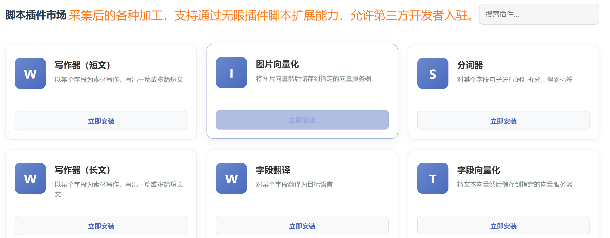
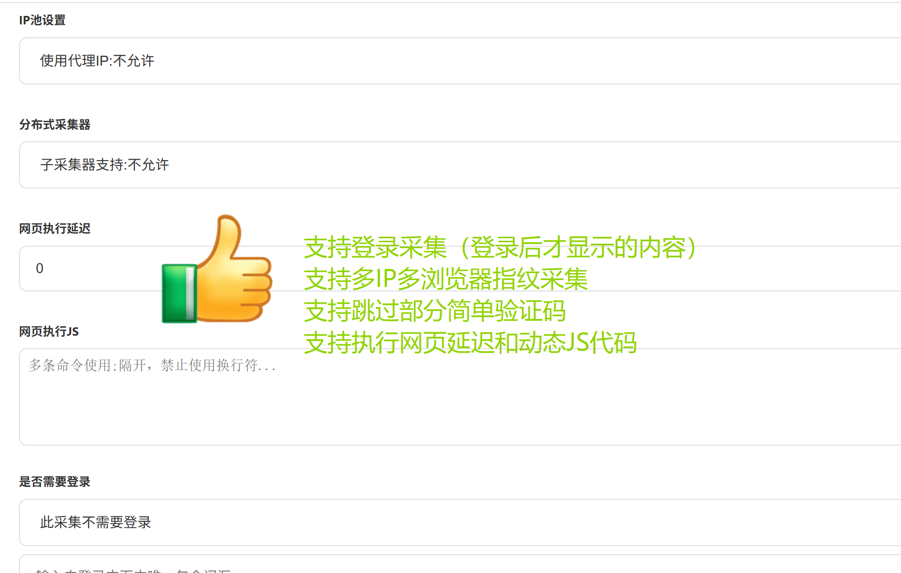
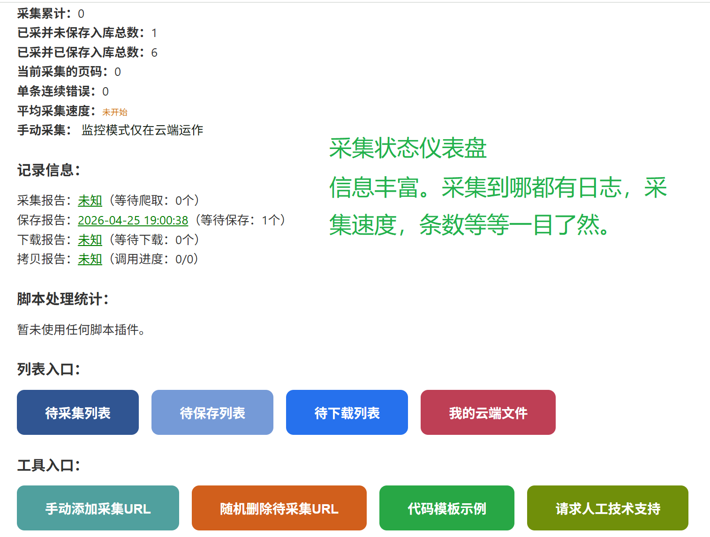

# 🕷️ Clawjub 采集平台

> 新一代智能采集器 | 官网：[clawjuc.com](https://clawjuc.com) | 社区交流：[clawjuc.com/help.php](https://clawjuc.com/help.php)

Clawjub 是一款**无需编程**、**云端+本地双模式**的网站数据采集平台。无论你是数据分析师、运营人员，还是普通电脑用户，都能通过点选式操作完成复杂的数据采集任务。

---

## ✨ 视频简介

通过5分钟快速了解平台功能：     
https://clawjuc.oss-cn-shanghai.aliyuncs.com/short.mp4     
演示一个任务的完整详细操作：    
https://clawjuc.oss-cn-shanghai.aliyuncs.com/clawjuc.mp4     

## ✨ 核心能力

- **内页的概念**：首先明白一个概念：新闻站详情页、视频站的具体播放页、资源内页、统一在系统内被称为成为内页。
- **三种采集模式**，适配任何网页结构，可应对不同场景：

  | 模式 | 适用场景 | 说明 |
  |------|----------|------|
  | **翻页采集** | 带页面/列表栏目的网站 | 自动遍历多页，从页提取内页ID，再进入内页采集数据 |
  | **内页采集** | 无分页，但内页ID递增或内页含内页的网站 | 适用于多数网站等 |
  | **监控数据** | 固定页面变化监测 | 设定条件触发通知，如商品降价、内容更新 |    
  不太理解的可以点此查看演示站：[clawjuc.com/demo/](https://clawjuc.com/demo/)    

---

## 🚀 使用流程

1. **填写目标网址与采集间隔**
2. **通过「保存器」定义要采集的字段名**（列名）
3. **提交任务，云端自动执行则无需下载软件，也可以下载软件本地采集**
4. **可选择继续自动加工转化，之后导出或分发采集结果**

---

## 🧠 人工智能创新

### 基于大语言模型（LLM）的智能采集
- **代码模式**：支持自定义获取数据的过程，支持PHP和Python和JS三种编程语言，自由扩展，满足高级需求。
- **零代码模式**：鼠标点选即可完成规则设定，无需编写代码，**电脑小白也能轻松上手**。
（上述二选一即可）

### 强大的加工脚本生态
- 对采集后的数据进行二次加工：
  - 文本分词
  - 自动翻译
  - AI智能改写
  - 任意组合处理
- **插件市场**：下载他人分享的脚本，也可自己编写上传。

---
## 🧠 媒体处理能力
支持采集图片和视频，自动下载。    
支持下载到Clawjuc云储存，或者阿里云OOS，或者本地电脑等三种数据保存方式。     
在脚本市场中心还有各种去水印，加水印，视频转码，MP4切片，图片向量化等众多免费脚本安装即用，非常方便。    

---

## 📤 多种导出与分发方式

| SQL, XLS, PDF, XML, JSON等常用文件格式    
| 工作流自动通知（8n8、Zapier、邮件、Webhook等）    
| API 实时分享采集结果（通过接口获取采集的数据）  
| 使用内置脚本分发到Wordpress，Zblog等几十种博客论坛平台    

---

## ☁️ 云端 + 本地双模式

- **云端采集**：关机照常运行，7×24小时不间断执行任务。
- **本地模式**：适合内网环境或本地调试，保护采集私密性。

---

## 🔒 高级特性

- ✅ **支持登录后采集**（Cookie/Session 维持）
- ✅ **多IP轮换** + **多指纹浏览器**（反反爬、分布式采集）
- ✅ **无限制**：存储空间不限，采集条数不限

---

## 🔗 链接

- 官方网站：[https://clawjuc.com](https://clawjuc.com)
- 论坛帮助 & 交流：[https://clawjuc.com/help.php](https://clawjuc.com/help.php)

> 📌 如有疑问或建议，欢迎访问论坛参与讨论。  
> 🎉 Clawjuc — 让数据采集变得前所未有的简单。

## 🔗 部分图片

  
   
   

